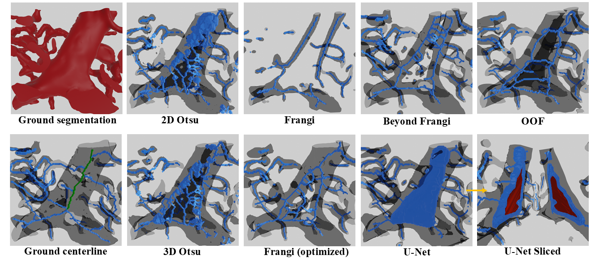

# MicroVasc-Review

**Review of Segmentation and Skeletonization Methods for Large-Scale Microvascular Networks**

This repository contains code and resources associated with the paper  
"*Segmentation and Modeling of Large-Scale Microvascular Networks: A Survey*" by Goharbavang *et al*.

<p align="center">
  
</p>

## Repository Content
The paper covers the following methods:

* **Binarization**: Otsu’s thresholding; Frangi vesselness; Beyond Frangi; Optimally Oriented Flux; U‑Net; nnU‑Net
* **Skeletonization**: Lee thinning; Palágyi thinning; Surface normal accumulation (Kerautret); Fast Marching (Kline); Mean curvature flow (Tagliasacchi); Voronoi‑based (Antiga)

This repository includes two CLI modules under 'implementations/' for a subset of these methods. For the rest, please see the External Resources section below for links to community or official implementations.

 - `Binarize.py`  
  Provides `otsu2d`, `otsu3d`, `frangi`, and `bfrangi`.

- `Skeleton.py`  
  Provides `lee`, `palagyi`, `kerautret`, and `kline` subcommands.

Other directories:
* `manage_data/` Scripts for preprocessing and converting raw imaging data (e.g., Numpy → NWT).

* `metrics/` Tools to compute quantitative evaluation metrics:

  * **Segmentation**: Jaccard index, Dice coefficient, precision, recall
  * **Skeletonization**: NetMets precision and recall

* `optimization/` Parameter-tuning and sensitivity-analysis scripts (grid search for scale, shape, and threshold parameters).

* `LICENSE` MIT License.

## Quick Start

1. **Clone the repo**

   ```bash
   git clone https://github.com/helia77/MicroVasc-Review.git
   cd MicroVasc-Review
   ```

2. **Install dependencies** (e.g., via Conda environment)

   ```bash
   # conda create --name microvasc
   # conda activate microvasc
   pip install -e .
   ```

3. **Verify CLI tools**

   ```bash
   binarize --help
   skeleton --help
   ```

4. **Run an algorithm**

   ```bash
   binarize frangi \
   --input path/to/volume.npy \
   --output path/to/out.npy \
   --background white \
   --params 0.5 0.5 3 \
   --scale 1 2 3 4
   --th otsu3d
   ```
<!---
5. **Evaluate results**

   ```bash
   cd metrics
   python evaluate.py --pred ../results/frangi --gt ../data/lsfm/gt
   ```

6. **Optimize parameters**

   ```bash
   cd optimization
   python optimize_frangi.py --modality KESM --scales 1 2 3 4
   ```
--->
## External Resources & Implementations
* **Beyond Frangi**: [https://github.com/timjerman/JermanEnhancementFilter](https://github.com/timjerman/JermanEnhancementFilter)
* **Optimally Oriented Flux**: [https://matlab.mathworks.com/open/fileexchange/v1?id=41612](https://www.mathworks.com/matlabcentral/fileexchange/41612-optimally-oriented-flux-oof-for-3d-curvilinear-structure)
* **U-Net**: [https://github.com/MrMras/CNN](https://github.com/MrMras/CNN)
* **nnU-Net**: [https://github.com/MIC-DKFZ/nnunet](https://github.com/MIC-DKFZ/nnunet)
* **Lee Thinning**: [https://github.com/scikit-image/scikit-image/blob/main/skimage/morphology/_skeletonize.py](https://github.com/scikit-image)
* **Palagyi Thinning**: [https://github.com/ClearAnatomics/ClearMap](https://github.com/ClearAnatomics/ClearMap)
* **Kerautret Centerline**: [https://github.com/kerautret/CDCVAM](https://github.com/kerautret/CDCVAM)
* **Kline Centerline**: [https://github.com/TLKline/poreture](https://github.com/TLKline/poreture)
* **Starlab MCF Skeletonization**: [https://github.com/taiya/starlab-mcfskel](https://github.com/taiya/starlab-mcfskel)
* **3D Slicer**: [https://www.slicer.org](https://www.slicer.org)

Refer to the paper for detailed methodology, evaluation results, and discussions.

## Running External Codes

### 1. **U-Net**
   
  * Installation:
    
    ```bash
    # Requirements
    # Python 3.12+
    # PyTorch, NumPy, OpenCV, tqdm, scipy, matplotlib
    git clone https://github.com/MrMras/CNN.git
    cd CNN
    
    conda env create -n cnn -f environment.yml
    conda activate cnn
    ```
  * Usage:
    
    ```bash
      # Upload .npy files under   ./unprocessed_data/{name_of_dataset}
      # Change the path to these files in ./create_volume_from_npy.py
      python ./create_volume_from_npy.py
      # Should create a folder ./data/{name_of_dataset} and add 2 files in there.
    
      cd ./model/       # change the paths in ./model.py to ./data/{name_of_dataset}/{files}
      python ./model.py EPOCHS -c
      #  Model will save the model under ./saved_models/{name_of_dataset}/model_for_vasc3d{random id}.pth.
    
      cd ../            # specify the path for the trained model and the path to the target volume (line 64)
      python ./run_model.py
      # Binary and probability maps will be generated in ./processed_npy/ and ./probability_npy/
    ```
    
### 2. **nnU-Net**
   
  * Installation:
    
    ```bash
    conda create -n nnunet python=3.9.*
    pip3 install torch torchvision torchaudio --index-url https://download.pytorch.org/whl/cu128
    pip install nnunetv2
    
    set nnUNet_raw = path/to/nnUNet_raw
    set nnUNet_preprocessed = path/to/nnUNet_preprocessed
    set nnUNet_results = path/to/nnUNet_results
    ```
  * Usage:
    
    ```bash
    # Use the new presets
    nnUNetv2_plan_experiment -d DATASET_ID -pl nnUNetPlannerResEncL
    # Extract fingerprint
    nnUNetv2_plan_and_preprocess -d DATASET_ID --verify_dataset_integrity
    # Train
    nnUNetv2_train DATASET__ID 3d_fullres 0/1/2/3/4 -p nnUNetResEncUNetLPlans
    # Predict
    nnUNetv2_predict -i INPUT_FOLDER -o OUTPUT_FOLDER -d DATASET_ID -c 3d_fullres -p nnUNetResEncUNetLPlans --save_probabilities
    nnUNetv2_apply_postprocessing -i FOLDER_WITH_PREDICTIONS -o OUTPUT_FOLDER --pp_pkl_file POSTPROCESSING_FILE -plans_json PLANS_FILE -dataset_json DATASET_JSON_FILE
    ```
